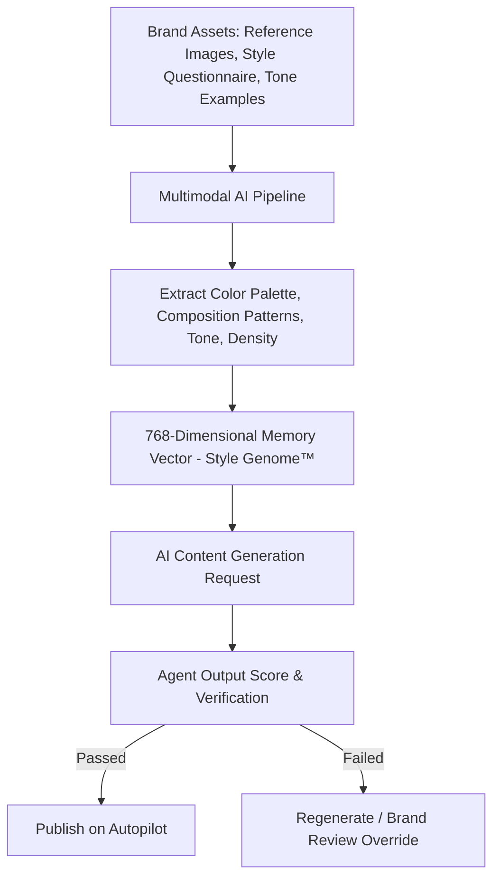

# CANLAH AI Product Research Report

> [!NOTE]
> This report provides an in-depth investigation of **CANLAH AI**, an AI-native autonomous agent workforce platform designed to automate business functions including marketing, sales, service, and commerce.

---

## Executive Summary

**CANLAH AI** (operated by CANLAH AI PTE. LTD., incorporated in Singapore in March 2026) is an AI-native platform that functions as an autonomous AI workforce. Rather than acting as simple prompt-based chat interfaces (like ChatGPT or Jasper), CANLAH AI focuses on building **multi-agent autonomous workflows** that coordinate end-to-end to manage business execution.

Its flagship capability is **Style Genome™**, a proprietary multimodal AI pipeline that encodes a brand's visual identity and voice into a persistent **768-dimensional memory vector**, ensuring that all AI-generated content (images, copy, optimization plans) aligns perfectly with the brand's unique identity.

---

## Core Product Suite

CANLAH AI delivers its capabilities through three main customer-facing products:

| Product Name | Core Function | Target Users | Channel / Platform | Key Features |
| :--- | :--- | :--- | :--- | :--- |
| **CanMarket** | AI Marketing Agent | Marketing Teams & CMOs | [app.canmarket.ai](https://app.canmarket.ai) | Brand-consistent content generation, campaign automation, and multi-channel publishing. |
| **CanArt** | AI Design Agent | Designers & Creators | [Telegram (CanArt Landing)](https://canart-landing.vercel.app/en) | Text-to-image (Seedream 4.5), smart image editing (Gemini-powered), 14-reference composition, posters, and typography in 3 seconds. |
| **CanSell** | AI Sales Agent for Stores | E-commerce Merchants | [Hatchery Bot (CanSell)](https://hatchery-bot.vercel.app) | Instant store URL crawling, multilingual sales chat, smart upselling (proven to increase AOV by 15%), and Shopify/WooCommerce integration. |

---

## Core Technology: Style Genome™

### What is Style Genome™?
Style Genome™ is CANLAH AI's proprietary technology designed to solve the "generic output problem" of standard LLMs. 

*   **Extraction**: Users upload reference images, define style parameters, and input brand guidelines (takes ~10 minutes).
*   **Vectorization**: The platform extracts color palettes, composition patterns, tone, and visual density, encoding them into a **768-dimensional vector**.
*   **Auto-Enforcement**: Every future content generation is automatically scored against this vector before being presented to the user.

---

## The AI Workforce: Ten Specialist Agents

CANLAH AI organizes its ten specialist agents into **three operating centers of gravity** to handle tasks from market signal ingestion to checkout conversion.

### 1. Decision Center (Sense. Strategize. Optimize.)
*   **Argus** (Market Intelligence): Senses market shifts, competitor moves, and content trends.
*   **Athena** (Strategy & HQ Superbrain): Evaluates inputs from Argus and creates high-level campaign strategies.
*   **Sage** (Performance Analysis): Analyzes campaign results and optimizes performance in real-time.

### 2. Public Outreach (Connect. Reach. Influence.)
*   **Apollo** (SEO / AEO Specialist): Optimizes content for search engines and AI engines (AEO/GEO).
*   **Calliope** (Content Creator): Generates copy, captions, and articles based on the Style Genome™ vector.
*   **Pheme** (KOL / PR Operations): Manages communications with Key Opinion Leaders (KOLs) and public relations channels.

### 3. Owned Channel Operations (Capture. Engage. Convert.)
*   **Hephaestus** (eCommerce & Page Optimization): Optimizes landing pages and product descriptions.
*   **Hestia** (AI Sales Concierge): Interacts with visitors to answer product questions and drive sales.
*   **Persephone** (User Recovery Strategist): Engages cart abandoners and re-activates dormant users.
*   **Iris** (WhatsApp Operations): Handles customer service and marketing automation inside WhatsApp.

---

## Interactive Feature: Generative Engine Optimization (GEO) Audit

To acquire customers, CANLAH AI offers a free web tool called **Audit My Site**. It scans a store or site URL to assess its **Generative Engine Optimization (GEO) score** (also referred to as AI visibility) across six key dimensions:

1.  **AI Citability**: Likelihood of being quoted by LLM engines (Gemini, ChatGPT, Perplexity).
2.  **Brand Authority**: Presence and indexability of brand mentions and unique data.
3.  **Content Quality**: Readability, relevance, and alignment with information-gain principles.
4.  **Technical Foundations**: Speed, crawler accessibility, and crawlability.
5.  **Structured Data**: Rich Schema.org markup optimization.
6.  **Platform Optimization**: Friendliness toward specific discovery channels.

---

## Product Comparison

| Feature | Generic AI (ChatGPT / Jasper) | Traditional 4A Agency | CANLAH AI Platform |
| :--- | :--- | :--- | :--- |
| **Brand Memory** | None (requires constant prompting) | Manual briefs, style guides | **Style Genome™** (768-d vector) |
| **Time to Content** | Instant | 3 to 4 weeks | **Under 48 hours** |
| **Brand Consistency** | Low / Generic output | High (but varies by team) | **Auto-enforced via vector score** |
| **Scalability** | High | Low (headcount-bound) | **Unlimited** |
| **Cost Model** | Per-token / API usage fee | High monthly retainer | **Predictable monthly plans** |
| **Data Security** | Shared / Public models | NDA only | **SOC 2 compliant, fully isolated** |
| **Availability** | 24/7 | Business hours | **24/7 Always On** |

---

## Pricing Model (CanMarket)

CanMarket is offered on three predictable monthly tiers, each backed by a **30-day exit guarantee** (full refund if month one falls short):

1.  **Starter ($1,600/month)**: Includes the AI CMO decision core (Athena + Argus + Sage) + **1 specialist agent**.
2.  **Standard ($2,400/month)**: Includes the AI CMO decision core + **3 specialist agents**.
3.  **Full Suite ($4,000/month)**: Includes the AI CMO decision core + **all 7 pillar agents** (Apollo, Calliope, Pheme, Hephaestus, Hestia, Persephone, Iris).

### Site Infrastructure Add-ons (One-time):
*   **Basic Site Build**: $1,500
*   **Custom Site Build**: $3,500
